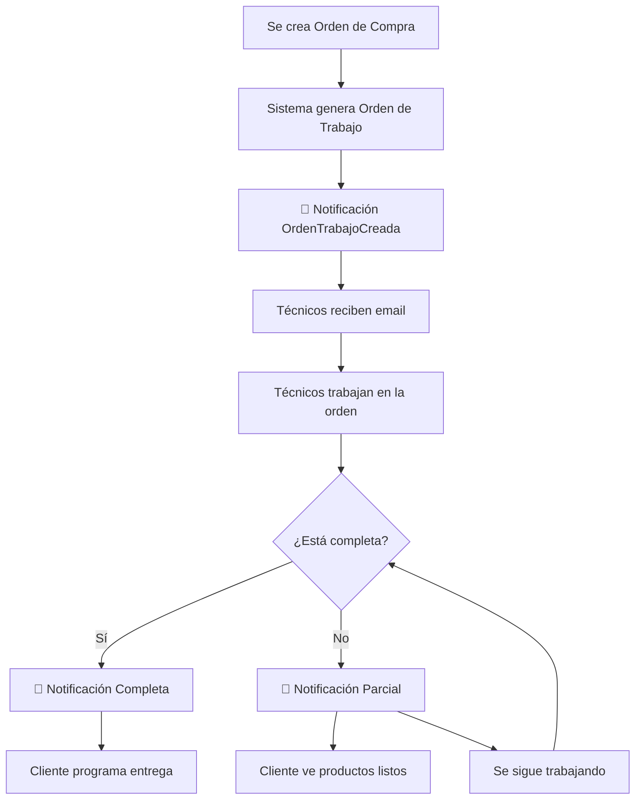

# 🔧 NOTIFICACIONES DE ÓRDENES DE TRABAJO - SISTEMA MEJORADO

## 📋 **FLUJO DE NOTIFICACIONES IMPLEMENTADO**

### 🎯 **Al Crear una Orden de Trabajo**
Cuando se genera una orden de trabajo desde una orden de compra, el sistema envía **3 tipos de notificaciones diferentes** a distintos destinatarios:

#### 1. **OrdenTrabajoGeneradaParaCreador** 
**🚀 Para:** Usuario que creó la orden de compra original
**📧 Plantilla:** `emails.orden-trabajo-generada-creador.blade.php`
**🎨 Color:** Verde (#28a745) - Confirmación positiva
**� Mensaje:** "¡Tu orden ya está en producción!"

#### 2. **OrdenTrabajoCreada (Inventario)**
**🚀 Para:** Todos los usuarios del departamento de Inventario 
**📧 Plantilla:** `emails.orden-trabajo-creada-limpia.blade.php`
**🎨 Color:** Naranja (#f39c12) - Trabajo técnico
**💬 Mensaje:** "Nueva orden requiere preparación de materiales"

#### 3. **OrdenTrabajoCreada (Operaciones por Sede)**
**🚀 Para:** Usuarios de Operaciones en la sede específica
**📧 Plantilla:** `emails.orden-trabajo-creada-limpia.blade.php`
**🎨 Color:** Naranja (#f39c12) - Trabajo técnico
**💬 Mensaje:** "Nueva orden de trabajo asignada"

---

## 👥 **DESTINATARIOS DETALLADOS - SISTEMA MEJORADO**

### 🎉 **Usuario Creador (1 notificación)**
```php
// Criterios de selección:
- $ordenCompra->user (quien hizo la orden de compra)

// Información específica:
- "Tu orden está en producción"
- Estado de avance
- Fecha estimada de entrega
- Botones: Ver Estado | Dashboard
```

### 📦 **Equipo de Inventario (múltiples notificaciones)**
```php
// Criterios de selección MEJORADOS:
User::where('departamento_id', $inventarioId)
    ->whereNotNull('email')
    ->get();

// MEJORA: Sin filtro de roles - todos los de inventario son relevantes
// Información específica:
- "Preparar materiales para producción"  
- Detalles técnicos de la orden
- Tiempo estimado de trabajo
- Botones: Ver Orden | Aceptar Trabajo
```

### 🏭 **Equipo de Operaciones (por sede) - MEJORA CRÍTICA**
```php
// Criterios de selección MEJORADOS:
User::where('sede_id', $ordenCompra->sede_id)
    ->where('departamento_id', $operacionesId) // FILTRO PRINCIPAL
    ->whereNotNull('email')
    ->get();

// ✅ MEJORA CRÍTICA IMPLEMENTADA:
// - Sin filtro de roles para evitar confusiones
// - Solo importa: Departamento = Operaciones + Sede específica
// - Evita que administradores de otros departamentos reciban notificaciones técnicas
// - Garantiza que SOLO operarios reciban las órdenes de trabajo

// Información específica:
- "Nueva orden de trabajo en tu sede"
- Área y ubicación específica
- Prioridad y consideraciones de seguridad
- Botones: Ver Orden | Aceptar Trabajo
```

## 🎯 **COMPARACIÓN: Antes vs Después**

### ❌ **Problema Anterior:**
```php
// Filtro por roles creaba confusión:
->whereIn('role_id', [4, 5, 6]) 

// Problema: 
// - Administradores (role 4) de Contabilidad recibían notificaciones técnicas
// - Operarios sin role específico se quedaban sin notificaciones
// - Lógica compleja y propensa a errores
```

### ✅ **Solución Implementada:**
```php  
// Filtro SOLO por departamento:
->where('departamento_id', $operacionesId)

// Ventajas:
// - Si estás en Operaciones = Recibes notificaciones técnicas
// - Si NO estás en Operaciones = No recibes notificaciones técnicas
// - Lógica simple y clara
// - Menos propenso a errores de configuración
```

---

## 🎨 **DISEÑO VISUAL POR DESTINATARIO**

### 🎉 **Para Creador (Verde Éxito)**
```css
Header: Gradiente verde (#d4edda → #28a745)
Icono: 🎉 (Celebración)
Badge: "🏭 EN PRODUCCIÓN" 
Tono: Positivo y tranquilizador
Foco: Estado y seguimiento
```

### 🔧 **Para Inventario/Operaciones (Naranja Trabajo)**
```css
Header: Gradiente naranja (#fff3cd → #f39c12)
Icono: 🔧 (Herramienta de trabajo)
Badge: Prioridad dinámica (🔥🟡🟢)
Tono: Técnico y accionable
Foco: Ejecución y detalles
```

---

## 💻 **IMPLEMENTACIÓN TÉCNICA DETALLADA**

### Código en OrdenCompraController (Líneas ~270-305):
```php
// 5. Notificaciones de Orden de Trabajo Creada

// Obtener IDs de departamentos
$operacionesId = Departamentos::where('nombre', 'Operaciones')->value('id');
$inventarioId = Departamentos::where('nombre', 'Inventario')->value('id');

// 1. Notificar al usuario que creó la orden de compra (mensaje específico)
if ($ordenCompra->user) {
    $ordenCompra->user->notify(new OrdenTrabajoGeneradaParaCreador($ordenTrabajo));
}

// 2. Notificar a usuarios de Inventario (todas las sedes)
$usuariosInventario = User::where('departamento_id', $inventarioId)
    ->whereIn('role_id', [3, 4, 5, 6]) // Roles relevantes para inventario
    ->get();

if ($usuariosInventario->count() > 0) {
    Notification::send($usuariosInventario, new OrdenTrabajoCreada($ordenTrabajo));
}

// 3. Notificar a usuarios de Operaciones de la sede específica
$usuariosOperacionesSede = User::where('sede_id', $ordenCompra->sede_id)
    ->where('departamento_id', $operacionesId)
    ->whereIn('role_id', [4, 5, 6]) // Roles de operaciones
    ->get();
    
if ($usuariosOperacionesSede->count() > 0) {
    Notification::send($usuariosOperacionesSede, new OrdenTrabajoCreada($ordenTrabajo));
}

// Log para seguimiento
Log::info('Notificaciones de Orden de Trabajo enviadas', [
    'orden_trabajo_id' => $ordenTrabajo->id,
    'orden_compra_id' => $ordenCompra->id,
    'usuario_creador' => $ordenCompra->user->name ?? 'N/A',
    'inventario_notificados' => $usuariosInventario->count(),
    'operaciones_notificados' => $usuariosOperacionesSede->count(),
    'sede' => $ordenCompra->sede->nombre ?? 'N/A'
]);
```

---

## 📊 **MÉTRICAS Y SEGUIMIENTO**

### 🔍 **Logging Implementado**
Cada envío de notificaciones genera un log con:
- IDs de orden de trabajo y compra
- Nombre del usuario creador
- Cantidad de usuarios notificados por departamento
- Sede involucrada
- Timestamp del envío

### 📈 **Estadísticas Esperadas**
- **Creador**: 1 notificación por orden
- **Inventario**: 3-8 usuarios (dependiendo del equipo)
- **Operaciones**: 2-5 usuarios por sede
- **Total promedio**: 6-14 notificaciones por orden de trabajo

---

### 2. **OrdenTrabajoListaParcial**
**🚀 Cuándo se envía:** Cuando una orden de trabajo está lista (completa o parcial)
**👥 Destinatarios:** Usuario que creó la orden de compra original
**📧 Plantilla:** `emails.orden-trabajo-lista-limpia.blade.php`

**Estados posibles:**
- ✅ **COMPLETA**: Todos los productos están listos (faltantes = 0)
- ⚠️ **PARCIAL**: Algunos productos listos, otros pendientes (faltantes > 0)

**Información incluida:**
- Estado visual (completa vs parcial)
- Número de unidades faltantes
- Fecha de entrega programada
- Botones de acción específicos por estado

---

## 🎨 **DISEÑO VISUAL POR ESTADO**

### Orden Creada (Naranja/Amarillo)
```css
Color Principal: #f39c12 (Naranja trabajo)
Gradiente Header: #fff3cd → #f39c12
Icono: 🔧 (Herramienta)
Prioridad Alta: #e74c3c (Rojo)
Prioridad Media: #f39c12 (Naranja)  
Prioridad Baja: #27ae60 (Verde)
```

### Orden Completa (Verde)
```css
Color Principal: #27ae60 (Verde éxito)
Gradiente Header: #d4edda → #27ae60
Icono: ✅ (Completa)
Botón Principal: "🚚 Programar Entrega"
```

### Orden Parcial (Amarillo/Advertencia)
```css
Color Principal: #f39c12 (Amarillo advertencia)
Gradiente Header: #fff3cd → #f39c12  
Icono: ⚠️ (Advertencia)
Botón Principal: "📦 Ver Productos Listos"
```

---

## 💻 **IMPLEMENTACIÓN TÉCNICA**

### Envío de Notificación - Orden Creada
```php
// En OrdenCompraController línea ~272
$operacionesId = Departamentos::where('nombre', 'Operaciones')->value('id');

$usuariosSede = User::where('sede_id', $ordenCompra->sede_id)
    ->where('departamento_id', $operacionesId)
    ->whereIn('role_id', [4, 6]) // Roles específicos
    ->get();
    
Notification::send($usuariosSede, new OrdenTrabajoCreada($ordenTrabajo));
```

### Envío de Notificación - Orden Lista
```php
// En OrdenCompraController línea ~298
if ($totalFaltantes < $ordenCompra->detalles->sum('cantidad')) {
    $faltantes = $ordenCompleta ? 0 : $totalFaltantes;
    $user->notify(new OrdenTrabajoListaParcial($ordenTrabajo, $faltantes));
}
```

---

## 📊 **VARIABLES DISPONIBLES EN PLANTILLAS**

### OrdenTrabajoCreada
```php
$ordenTrabajo->id                    // ID numérico
$ordenTrabajo->tipo_trabajo         // Tipo de mantenimiento
$ordenTrabajo->prioridad           // alta, media, baja  
$ordenTrabajo->descripcion         // Descripción del trabajo
$ordenTrabajo->area                // Área de trabajo
$ordenTrabajo->fecha_limite        // Fecha límite (Carbon)
$ordenTrabajo->estimacion_horas    // Horas estimadas
$ordenTrabajo->consideraciones_seguridad // Texto seguridad
$usuario->name                     // Nombre del técnico
```

### OrdenTrabajoListaParcial  
```php
$ordenTrabajo->id                  // ID numérico
$ordenTrabajo->nombre             // Nombre de la orden
$ordenTrabajo->fecha_entrega      // Fecha entrega (Carbon)
$faltantes                        // Número de unidades faltantes
$usuario->name                    // Nombre del cliente
```

---

## 🔄 **FLUJO COMPLETO DE NOTIFICACIONES**



---

## ✅ **BUENAS PRÁCTICAS IMPLEMENTADAS**

### 🎯 **Segmentación de Usuarios**
- Creación: Solo notifica a técnicos relevantes (Operaciones, roles 4 y 6)
- Completado: Solo notifica al cliente que hizo el pedido

### 🎨 **Diseño Profesional**
- Colores consistentes con la identidad corporativa
- Estados visuales claros y diferenciados  
- Información esencial sin saturar
- Botones de acción específicos por contexto

### 📱 **Responsive y Accesible**
- Diseño adaptable a móviles
- Contraste adecuado para accesibilidad
- Iconos universales para fácil comprensión

### ⚡ **Optimización de Contenido**
- Plantillas "limpias" con información esencial
- Carga rápida con CSS inline
- Texto conciso y accionable

---

## � **CASOS PRÁCTICOS - QUIÉN RECIBE QUÉ**

### ✅ **Escenarios de Notificación Correcta:**

**Usuario: Juan Pérez**
- Departamento: Operaciones
- Sede: Bogotá  
- Role: 4 (Administrativo)
- **✅ RECIBE** notificaciones de órdenes de trabajo de Bogotá

**Usuario: María García**  
- Departamento: Contabilidad
- Sede: Bogotá
- Role: 4 (Administrativo)
- **❌ NO RECIBE** notificaciones de órdenes de trabajo (no es de Operaciones)

**Usuario: Carlos López**
- Departamento: Operaciones  
- Sede: Medellín
- Role: 5 (Técnico)
- **✅ RECIBE** notificaciones de órdenes de trabajo de Medellín
- **❌ NO RECIBE** notificaciones de órdenes de trabajo de Bogotá

**Usuario: Ana Rodríguez**
- Departamento: Inventario
- Sede: Cualquiera  
- Role: Cualquiera
- **✅ RECIBE** todas las notificaciones de órdenes de trabajo (inventario es transversal)

---

## 💡 **VENTAJAS DEL NUEVO SISTEMA:**

### 🎯 **Precisión en Destinatarios**
- ✅ Solo personal técnico recibe notificaciones técnicas
- ✅ Personal administrativo no se satura con información irrelevante  
- ✅ Cada sede solo recibe sus órdenes específicas

### 🔧 **Simplicidad de Mantenimiento**
- ✅ No depende de configuración compleja de roles
- ✅ Agregar nuevos empleados es automático (solo asignar departamento)
- ✅ Cambiar empleado de departamento actualiza automáticamente las notificaciones

### 📈 **Escalabilidad**
- ✅ Funciona con cualquier cantidad de roles por departamento
- ✅ Se adapta a reorganizaciones empresariales
- ✅ Nuevo personal recibe notificaciones sin configuración adicional

---

## �🚀 **PRÓXIMAS MEJORAS SUGERIDAS**

1. **Notificación de Recordatorio**: Para órdenes que se acercan a la fecha límite
2. **Notificación de Retraso**: Cuando una orden excede el tiempo estimado
3. **Notificación de Materiales**: Cuando faltan materiales para continuar
4. **Dashboard de Órdenes**: Vista unificada de todas las órdenes activas
5. **Filtros por Turno**: Notificar solo al personal del turno correspondiente

---

**Las notificaciones están diseñadas para mantener informado a todo el equipo sobre el progreso de las órdenes de trabajo, mejorando la comunicación y eficiencia operativa.** 🌟
